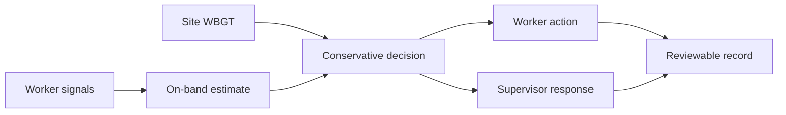

# CoreSense

**Personal heat-risk intelligence at the edge.**

CoreSense is a worker-safety prototype that combines on-wrist sensing, site conditions, conservative decision rules, clear worker actions, supervisor escalation, and a reviewable event record.

[View the live CoreSense experience](https://core-sense.vercel.app)


## The Product

Heat strain can build before a worker or supervisor sees an obvious problem. CoreSense is designed to turn that uncertainty into one operational loop:

```text
Sense -> Estimate -> Decide -> Act -> Record
```

- **Sense:** collect worker and site signals without sending raw optical data off the band.
- **Estimate:** derive a personal thermal-strain estimate using the documented Buller heart-rate-to-ECTemp model.
- **Decide:** combine the estimate, signal quality, trend, and site WBGT through conservative rules.
- **Act:** show a direct on-wrist instruction such as `BAND OK`, `CAUTION`, or `REST NOW`.
- **Record:** preserve acknowledgements, escalations, recovery events, and important uncertainty for review.



## What Is Implemented

- Responsive, media-rich CoreSense product experience
- Local product imagery plus autoplaying, muted, looping scenario video
- Five interactive use-case states with worker and supervisor outcomes
- Evidence, architecture, privacy, verification, and limitation summaries
- Searchable in-site reader for all 31 supplied Markdown documents
- Mobile and desktop layouts with reduced-motion handling
- Static production build configured for Vercel
- Rendered-output tests for product content and removed legacy material

## Evidence Boundary

CoreSense is a safety decision-support prototype. It is not a clinical thermometer or medical device, and the current materials do not establish clinical accuracy, field effectiveness, assembled-device runtime, durability, or certification.

The interface keeps those limits visible. It presents personal guidance as one input beside site WBGT, existing heat controls, trained supervision, and established emergency procedures.

## Document Library

The deployed site includes a searchable document reader backed by `public/docs`. Every source link opens inside the CoreSense experience, so architecture, science, validation, bill-of-materials, pilot, field-footage, and outreach documents can be reviewed without downloading the repository.

The library is indexed in `app/docs-manifest.ts` and rendered by `app/DocumentLibrary.tsx` with GitHub-flavored Markdown support.

## Technology

- React 19
- TypeScript
- Vinext and Vite 8
- `react-markdown` with `remark-gfm`
- Node.js built-in test runner
- Vercel static deployment

## Local Development

Requires Node.js `>=22.13.0`.

```bash
npm install
npm run dev
```

Open the local URL printed by Vite.

## Verification

```bash
npm run lint
npm test
npm run vercel-build
```

The test suite validates the rendered product sections, local media, document library, product metadata, removed control overlays, and CoreSense-only identity in the current source tree.

## Project Structure

```text
app/
  SmartWatchClone.tsx    Main CoreSense experience
  coresense-content.ts   Structured product and scenario content
  DocumentLibrary.tsx    Embedded Markdown reader
  docs-manifest.ts       Document index
  globals.css            Responsive visual system
public/
  coresense/             Product images, previews, and video
  docs/                  Embedded project documentation
tests/
  rendered-html.test.mjs Rendered-output regression coverage
```

## Deployment

The Vercel build uses `npm run vercel-build` and publishes `dist/vercel` as a static production output.

```bash
npx vercel deploy --prod
```

Production: [core-sense.vercel.app](https://core-sense.vercel.app)

## Source Material

The product claims, decision boundaries, implementation notes, and known limitations shown on the site are derived from the versioned documents in `public/docs`. Start with:

- [`ONE-PAGE-SUMMARY.md`](public/docs/ONE-PAGE-SUMMARY.md)
- [`architecture.md`](public/docs/architecture.md)
- [`science.md`](public/docs/science.md)
- [`WOKWI-VERIFICATION.md`](public/docs/WOKWI-VERIFICATION.md)
- [`limitations.md`](public/docs/limitations.md)
